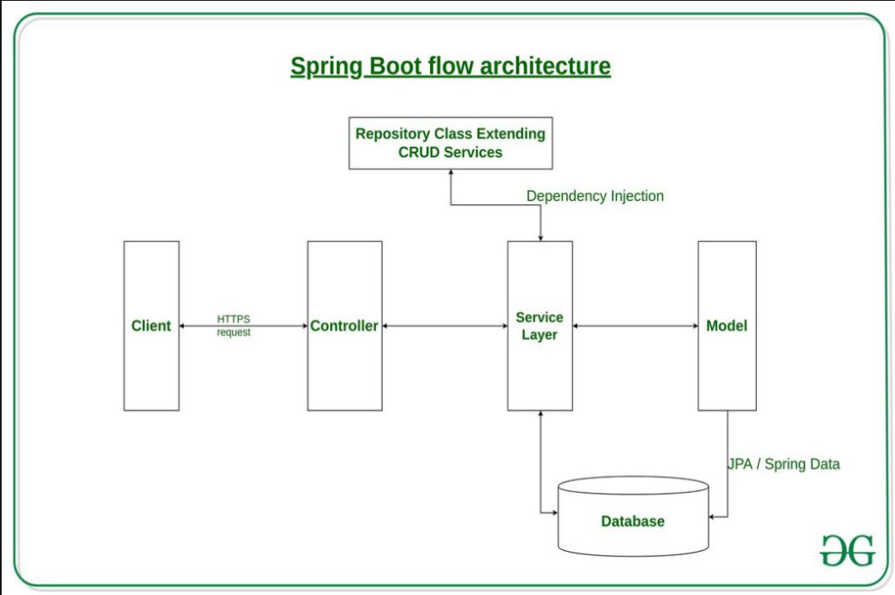

Spring Layered Architecture \
\

# Arquitetura Spring Layered Architecture (Model, Repository, Service, Controller)

## 1. Model
- Representa os **dados e regras de negócio**.
- Geralmente são classes anotadas com `@Entity` ou DTOs.
- Exemplo de responsabilidades:
  - Estruturar os dados da aplicação.
  - Validar atributos básicos (como `@NotNull`, `@Size`).

## 2. Repository
- Camada de **persistência**, interage diretamente com o banco de dados.
- Implementada com Spring Data JPA (`JpaRepository`) ou R2DBC.
- Exemplo de responsabilidades:
  - Operações CRUD.
  - Consultas customizadas.

## 3. Service
- Contém a **lógica de negócio** da aplicação.
- Atua como intermediário entre Repository e Controller.
- Exemplo de responsabilidades:
  - Regras de validação complexas.
  - Processamento de dados antes de salvar ou retornar ao cliente.

## 4. Controller
- Camada de **entrada** da aplicação.
- Recebe requisições HTTP (`GET`, `POST`, `PUT`, `DELETE`) e chama os Services.
- Exemplo de responsabilidades:
  - Mapear URLs e endpoints.
  - Retornar respostas em JSON ou outro formato.

---

